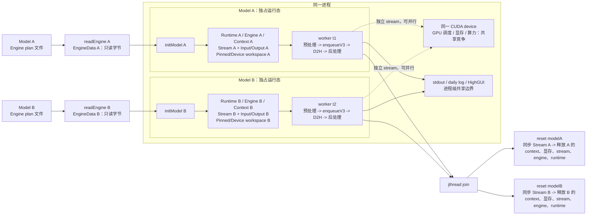

# YOLO26 + TensorRT 11

模型要求：

- TensorRT11 CUDA13 C++20 
- 支持编译 CUDA `.cu` 文件的 CUDA Toolkit
- 包含 `core`、`imgcodecs`、`imgproc` 和 `highgui` 模块的 OpenCV
- 动态 batch 输入 `[-1, 3, H, W]`
- profile 的最小 batch 必须是 1
- YOLO end-to-end 输出 `[N, max_det, 6]`

## C++20 与资源所有权

项目同时以 C++20 和 CUDA C++20 编译。`Model` 是不可复制、不可移动的 RAII 类型，通过
`Model&` 显式传给初始化、预处理、推理和后处理函数。`initModel(model, engineData)` 会先
释放该实例已有的模型资源，再加载新 Engine，因此也可以分别初始化和使用多个 `Model` 实例。
TensorRT runtime、engine、execution context，以及 CUDA stream、event、device memory 和
pinned memory 都由 `std::unique_ptr` 与对应 deleter 管理。正常退出或初始化、推理过程中抛出
异常时，资源都会按依赖顺序自动释放，不需要手动调用清理函数；但 worker 线程中的异常若
未捕获会触发 `std::terminate`，不会走正常的错误汇总流程。

只读连续数据接口使用 `std::span` 表达非拥有关系，路径使用 `std::filesystem::path`；实现中
同时使用 ranges、指定初始化器、`[[nodiscard]]` 和 `constexpr` 等现代 C++ 写法。

## 多模型运行与隔离边界

当前 `main()` 为便于测试只读取一次 Engine plan，然后用同一份只读 `EngineData` 初始化
`modelA` 和 `modelB`。在实际部署中，两个实例也可以分别读取各自的 Engine plan；无论
plan 是否相同，每次 `initModel()` 反序列化都会创建自己的 TensorRT `IRuntime`、
`ICudaEngine` 和 `IExecutionContext`，并分配自己的 CUDA stream、输入/输出显存以及
pinned/device 预处理 workspace。因此两个 worker 不会共享 TensorRT context、workspace
或 I/O 缓冲区，`modelA` 的 batch/shape 状态也不会改写 `modelB`。

隔离是“同一进程内的对象所有权隔离”，不是进程级沙箱或 GPU 资源配额。两个实例仍共享
当前 CUDA device/primary context、GPU 显存与算力、TensorRT/CUDA 驱动，以及进程级日志和
OpenCV HighGUI 后端。显存压力会累加；代码通过 `Model.deviceId` 在初始化和每个 worker
入口显式调用 `cudaSetDevice`。默认 `modelADevice/modelBDevice` 都是 0；有第二张 GPU
时可将后者改为 1，并让对应模型始终固定在该设备上。

每个 worker 的一轮调用都遵循“设置 batch -> 预处理 -> `enqueueV3` -> D2H -> 后处理”。
预处理和推理会同步自己的 stream，所以同一个 `Model` 不能被多个线程同时调用；两个不同
实例的独立 stream 可以由 GPU 调度器重叠执行，但会竞争同一块 GPU 的资源。`std::jthread`
在析构时等待 worker 结束，随后 `Model` 的 RAII 清理才会同步 stream 并释放资源。

示例中的两个 worker 会分别打开同一个视频文件，各自解码和维护帧计数；它们不是把同一帧
广播给两个模型，帧进度也不保证同步。若要实现同帧多模型 ensemble，需要在上游共享解码帧，
再为每个模型复制只读视图，并额外设计结果汇聚和停止控制。



图中“独占”只表示 `Model` 对象的逻辑所有权；GPU、日志和 GUI 仍是共享边界。日志现在会
自动添加 `[modelA]`/`[modelB]` 标签，但为避免推理线程等待，控制台和文件写入不加互斥，
高并发时行间可能交错。HighGUI 是 OpenCV 的窗口和事件模块（`namedWindow`、`imshow`、
`waitKey` 等）；其后端通常要求由单一 UI 线程处理事件。当前视频示例仍由 worker 刷新窗口，
生产代码应让 worker 只产出帧，由 UI 线程统一显示和处理按键。

目录模式通过 `runVideo = false` 依次调用 `detectImageDirectory(modelA, ...)` 和
`detectImageDirectory(modelB, ...)`，窗口名也会带模型前缀。依次显示是为了避免两个线程
同时驱动 HighGUI；视频模式才使用两个 worker 并行推理。

如果需要真正的硬隔离，不能只在当前进程里增加 `Model` 实例；应把模型拆到不同进程，分别
绑定独立 GPU、MIG 实例或外部显存/资源配额。当前实现提供的是同一进程内的逻辑隔离。

## 所有权与许可

Copyright (C) 2026 liqiuzhuang (GitHub: liautumn) and contributors

本项目中由 liqiuzhuang 创作的原创源代码和文档，其著作权归 liqiuzhuang
所有，并依据 GNU General Public License version 3 授权使用；该授权不构成
所有权转让。第三方材料仍归各自权利人所有。具体范围见 [NOTICE](NOTICE)，
完整许可条款见 [LICENSE](LICENSE)。

## 生成 Engine

```powershell
# Windows
trtexec.exe `
  --onnx=model/yolo26n.onnx `
  --saveEngine=model/win.engine `
  --minShapes=images:1x3x640x640 `
  --optShapes=images:1x3x640x640 `
  --maxShapes=images:1x3x640x640
```

```bash
# Linux
trtexec \
  --onnx=model/yolo26n.onnx \
  --saveEngine=model/linux.engine \
  --minShapes=images:1x3x640x640 \
  --optShapes=images:1x3x640x640 \
  --maxShapes=images:1x3x640x640
```

代码直接读取 `trtexec` 生成的纯 TensorRT plan。

## 运行

在 [src/main.cpp](src/main.cpp) 开头修改 engine 和图片路径，然后运行：

预处理按当前推理 batch 执行：原始 BGR 图片先复制到 pinned memory，再通过
`cudaMemcpyAsync` 上传，CUDA kernel 完成保持宽高比的 letterbox、114 填充、双线性插值、
BGR 到 RGB 和 `1/255` 归一化，并直接写入 FP32 NCHW 输入显存。后处理使用同一组逆仿射矩阵还原检测框。

图片目录模式在所有图片处理完成后为每张图片创建一个结果窗口。框和 `class`、`score` 标签
直接来自 `results[i]`，绘制发生在原图副本上，不会修改原始图片或检测数据。在任意结果窗口
按键后，目录模式会关闭该显示阶段创建的全部窗口并返回。视频模式则由每个 worker 自己刷新
窗口；按键只结束当前 worker，另一个 worker 不会自动停止。绘制、窗口刷新和按键等待均位于
耗时统计之外。

`main()` 只负责拼装：

- `readEngine` / `initModel`：`src/model.cpp`
- CUDA memory、stream 和 event 的 RAII 管理：`src/cuda_raii.cpp`
- `loadImages`：`src/image.cpp`
- `splitByMaxBatch`：`src/batch.cpp`
- `preprocessBatchToGpu`：`src/preprocess.cu`
- `setBatchSize` / `infer` / `copyToCpu`：`src/inference.cpp`
- `printBatchResults` / `showResults`：`src/result.cpp`

在 CLion 中点击 `main()` 里的函数名即可跳到对应流程。图片目录路径仍由
`detectImageDirectory()` 按批次串行处理；当前默认入口则创建两个 `std::jthread`，分别
对同一个视频文件使用 `modelA` 和 `modelB`。H2D 虽通过各自 CUDA stream 异步提交，但
预处理和推理函数返回前都会同步该实例的 stream，因此当前没有同一实例内的跨批次流水线。
`main()` 返回时，`jthread` 先等待 worker，再由 `Model` 自动释放全部 TensorRT 和 CUDA 资源。

图片目录模式会把各批次结果按输入顺序追加到 `results`，因此 `results[i]` 始终与
`images[i]` 一一对应；视频模式则在每个 worker 内即时显示当前帧。

# Linux 环境配置

## 1. 安装 C/C++ 开发工具链

### 更新软件源

```bash
sudo apt update
```

### 安装 C/C++ 编译环境

`build-essential` 包含：

- gcc
- g++
- make
- libc 开发文件
- 常用编译工具

```bash
sudo apt install build-essential
```

验证：

```bash
gcc --version
g++ --version
make --version
```

---

### 安装调试工具

#### Valgrind

用于：

- 内存泄漏检测
- 内存错误分析
- 性能分析

```bash
sudo apt install valgrind
```

#### GDB

GNU 调试器，用于：

- C/C++ 程序断点调试
- 崩溃分析
- 查看堆栈信息

```bash
sudo apt install gdb
```

验证：

```bash
gdb --version
```

---

### 安装 CMake

用于 C/C++ 项目构建：

```bash
sudo apt install cmake
```

验证：

```bash
cmake --version
```

---

### 安装 Git

用于代码管理：

```bash
sudo apt install git
```

验证：

```bash
git --version
```

---

## 2. 安装 OpenCV 开发库

安装 OpenCV C++ 开发环境：

```bash
sudo apt install libopencv-dev
```

验证：

```bash
pkg-config --modversion opencv4
```

---

# 3. 安装 Nvidia 驱动 和 CUDA

官方安装地址：

- Nvidia 驱动  
  https://www.nvidia.cn/geforce/drivers

- CUDA Toolkit  
  https://developer.nvidia.com/cuda-downloads


安装完成后确认：

```bash
nvidia-smi
nvcc --version
```

---

# 4. 安装 TensorRT

官方安装地址：

- TensorRT 11.x  
  https://developer.nvidia.com/tensorrt/download/11x


解压示例：

```bash
tar -xf TensorRT-11.2.1.2.tar.gz
```

假设安装目录：

```text
/home/autumn/dev/TensorRT-11.2.1.2
```

---

# 5. 配置环境变量

编辑用户环境：

```bash
nano ~/.bashrc
```

添加：

```bash
# ==========================
# CUDA
# ==========================
export CUDA_HOME=/usr/local/cuda-13.3

export PATH=$CUDA_HOME/bin:$PATH
export LD_LIBRARY_PATH=$CUDA_HOME/lib64:$LD_LIBRARY_PATH

export CUDACXX=$CUDA_HOME/bin/nvcc


# ==========================
# TensorRT
# ==========================
export TENSORRT_PATH=/home/autumn/dev/TensorRT-11.2.1.2

export PATH=$TENSORRT_PATH/bin:$PATH
export LD_LIBRARY_PATH=$TENSORRT_PATH/lib:$LD_LIBRARY_PATH
```

保存退出：

```
Ctrl + O
Enter
Ctrl + X
```

---

# 6. 重新加载环境变量

```bash
source ~/.bashrc
```

---

# 7. 验证安装

## CUDA

```bash
nvcc --version
```

示例：

```text
Cuda compilation tools, release 13.3
```

---

## TensorRT

查看版本：

```bash
trtexec --version
```

示例：

```text
TensorRT 11.2.1
```

---

## OpenCV

```bash
pkg-config --modversion opencv4
```

---

## 检查动态库

```bash
echo $LD_LIBRARY_PATH
```

应该包含：

```text
/usr/local/cuda-13.3/lib64
/home/autumn/dev/TensorRT-11.2.1.2/lib
```
